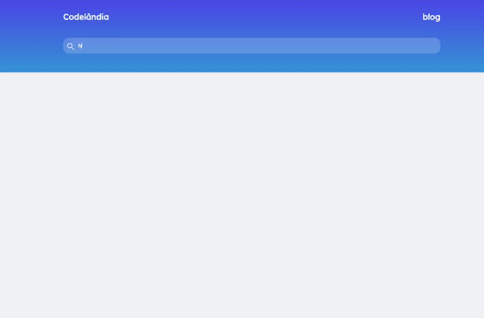

## Bem vindo a R2 Telecomunicações
---
Buscamos profissionais determinados, que não desanimam frente aos obstáculos e que irão buscar em seus conhecimentos, experiências e através do trabalho em equipe, uma forma de superar as dificuldades. Este desafio serve para testemunharmos a demonstração das suas super habilidades. Boa sorte!!!


### Sobre o Projeto
---
Este projeto foi criado com o intuito de pesquisar notícias sobre um determinado assunto em vários portais de notícias simultaneamente.

A nossa equipe de desenvolvimento, iniciou o projeto e tudo estava caminhando bem, até que precisaram iniciar o desenvolvimento de um outro projeto, com isso, ficamos com algumas pendências e/ou falhas que precisam ser corrigidas.

### Tarefas

- Layout
  - [ ] Centralizar os cards de notícias quando a janela for maior do quê 992px
- Pesquisa de Notícias
  - [x] Trazer Notícias em língua portuguesa quando abrir a página
  - [ ] Trazer Notícias usando palavras-chave digitadas no campo de pesquisa
- Botão de Like
  - [ ] Corrigir o botão, para que fique selecionado após o click (Conforme mostrado no exemplo abaixo)
- Link para Notícia
  - [ ] O título das notícias deve ser um link para a notícia
  - [ ] Criar um efeito quando o mouse estiver sobre o link (Efeito mostrado no exemplo abaixo)
- Data da Notícia
  - [ ] Formatar a data (Conforme mostrado no exemplo abaixo)


  Obs.: Caso perceba alguma outra funcionalidade interessante ou até mesmo alguma falha, fique a vontade para corrigir e/ou sinalizar.

### Exemplo de Funcionamento

<h1 align="center">
  
</h1>

### Executando o projeto

* Node - v12.22.12

É necessário instalar o `Node`, conforme a versão informada. Pode ser instalado em qualquer S.O. (Windows, Linux, MacOS).

Em seguida, instale o `http-server`:

```bash
$ npm install http-server -g
```

Para executar o projeto, entre na pasta do projeto e execute o `http-server`:

```bash
$ http-server
```

Por fim, acesse o endereço `http://localhost:8080`
Obs.: O `http-server` utiliza por padrão a porta 8080, porém, caso já esteja sendo utilizada, pode ser que suba o serviço utilizando outra porta. A porta é informada ao executar o `http-server`.

### Extra

- [Link para layout do projeto](https://www.figma.com/file/z9M8fTpnShtRbukUUPoFue/Desafio?node-id=0%3A1)

- Queremos manter o layout fiel ao que foi projetado. Seria muito bom que ao final do teste, tivéssemos o projeto exatamente com o layout projetado e completamente funcional.

Boa sorte!